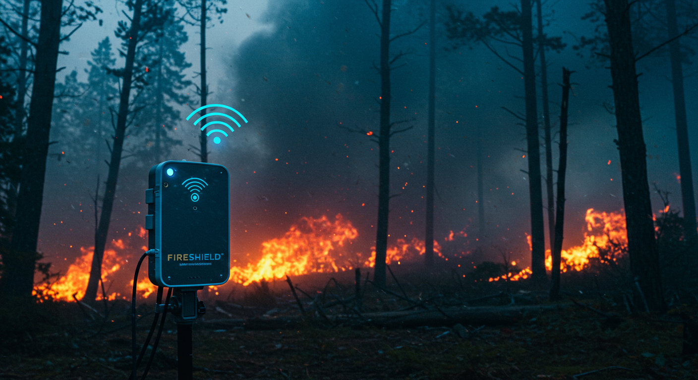
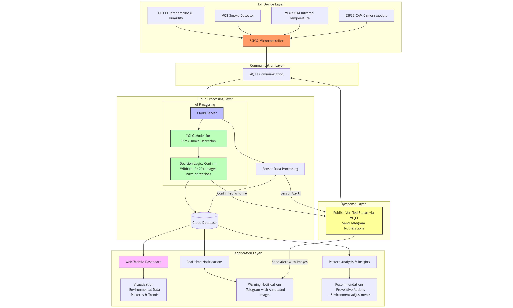
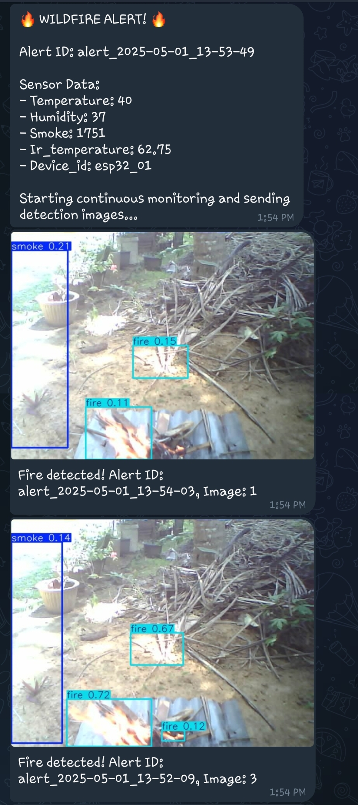
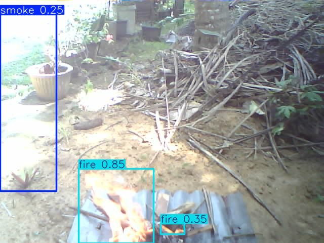
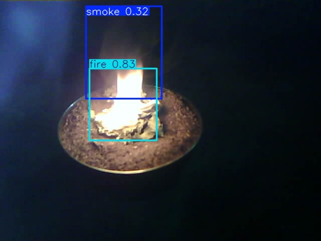

# FirePredict360: ML-Powered Wildfire Detection & Monitoring

  
_Real-time wildfire detection using IoT, machine learning, and cloud technology._

**FirePredict360** is an advanced wildfire detection and monitoring system that integrates IoT sensors, machine learning (ML) models, and cloud-based analytics to provide real-time alerts and predictive insights. By leveraging ESP32-based IoT devices, YOLO-based fire detection, LSTM predictive models, and a Node-RED dashboard, FirePredict360 enhances early wildfire detection and response.

---

## Table of Contents

- [FirePredict360: ML-Powered Wildfire Detection \& Monitoring](#firepredict360-ml-powered-wildfire-detection--monitoring)
  - [Table of Contents](#table-of-contents)
  - [Features](#features)
  - [System Architecture](#system-architecture)
  - [Data Flow and Processing Workflow](#data-flow-and-processing-workflow)
  - [Components](#components)
    - [IoT Devices](#iot-devices)
    - [Cloud Backend](#cloud-backend)
    - [Machine Learning Models](#machine-learning-models)
    - [Dashboard](#dashboard)
    - [Data Management](#data-management)
  - [Hardware and Sensors](#hardware-and-sensors)
    - [Microcontroller](#microcontroller)
    - [Camera Module](#camera-module)
    - [Sensors](#sensors)
    - [Actuators](#actuators)
    - [Display](#display)
    - [Additional Hardware](#additional-hardware)
    - [Environment Variables](#environment-variables)
    - [Pin Configuration](#pin-configuration)
  - [Installation](#installation)
    - [Prerequisites](#prerequisites)
    - [Setup](#setup)
  - [Usage](#usage)
  - [Contributing](#contributing)
  - [Acknowledgements](#acknowledgements)

---

## Features

- **Real-Time Detection**: IoT sensors and cameras detect fire/smoke instantly.
- **ML-Powered Analytics**: YOLO for fire detection and LSTM for sensor data predictions.
- **Cloud Integration**: Processes data via MQTT and stores it in MongoDB.
- **Automated Alerts**: Sends Telegram notifications with images upon wildfire detection.
- **Local Visualization**: OLED display (128x64) shows real-time sensor data and alerts.
- **Interactive Dashboard**: Visualizes sensor data and alerts using Node-RED.
- **Scalable Design**: Modular architecture for easy expansion.



---

## System Architecture

FirePredict360 operates as a distributed system:

1. **IoT Devices**: ESP32 modules collect sensor data (temperature, humidity, smoke, IR temperature) and capture images.
2. **Cloud Backend**: Receives data via MQTT, processes it with ML models, and stores it in MongoDB.
3. **ML Models**: YOLO detects fire/smoke; LSTM predicts sensor trends.
4. **Dashboard**: Node-RED visualizes real-time data and alerts.
5. **Notifications**: Telegram bot sends alerts with images.
6. **Local Display**: OLED display shows sensor readings and system status.
<div style="display: flex; justify-content: space-between; height: 300px;">
  
  
</div>

---

## Data Flow and Processing Workflow

The FirePredict360 system follows a streamlined workflow to detect and respond to wildfires. Below is the step-by-step data flow:

1. **Data Collection by IoT Devices**:

   - The ESP32 sensor device (`iot_device`) collects environmental data using:
     - **DHT11**: Temperature and humidity.
     - **MQ-2**: Smoke levels.
     - **MLX90614**: IR temperature (heat signatures).
   - Data is processed locally in `main.cpp`, displayed on the SSD1306 OLED (128x64) display, and published to an MQTT broker (HiveMQ Cloud) under topics like `esp32_01/sensors/data` using `mqtt.cpp`.
   - Local actuators (buzzer, RGB LEDs, single-color LEDs) and OLED display activate if thresholds are exceeded (e.g., high smoke or IR temperature).

2. **Data Transmission to Cloud**:

   - The cloud backend (`cloud_backend/api/app_script`) subscribes to MQTT topics via `mqtt_client/client.py`.
   - Sensor data (temperature, humidity, smoke, IR temperature) is received in real-time and stored in MongoDB using `db_utils.py`.

3. **Wildfire Risk Assessment**:

   - The `ai_pipeline.py` script analyzes sensor data for anomalies (e.g., high temperature, high smoke, elevated IR temperature, low humidity).
   - If a `potential_wildfire` flag is triggered (based on predefined thresholds), the system initiates image capture.

4. **Image Capture**:

   - The ESP32-CAM device (`camera_device/CameraWebServer`) is activated via `camera/capture.py`.
   - It captures 12 images over 60 seconds (5-second intervals) at UXGA resolution (1600x1200) using the OV2640 camera.
   - Images are saved to `wildfire_images/`.

5. **Fire Detection with ML**:

   - The `ai_detection/fire_detector.py` script processes images using a YOLO model (`fire_l.pt`).
   - YOLO identifies fire or smoke with bounding boxes and confidence scores.
   - If fire/smoke is detected above a threshold, an alert is generated.

6. **Predictive Analytics**:

   - The `prediction_service.py` script uses LSTM models (e.g., `fe_lstm_temperature_model.h5`) to predict future values of temperature, humidity, smoke, and IR temperature (24 steps ahead) based on 60 recent data points.
   - Predictions are accessible via `/predict` and `/predict-from-db` API endpoints in `api_server.py`.

7. **Notifications**:

   - If fire/smoke is confirmed, `notifications/telegram_notifier.py` sends an alert to a Telegram chat with a summary (e.g., sensor readings, confidence score) and detected images.

8. **Visualization**:

   - Sensor data, predictions, and alerts are sent to the Node-RED dashboard (`dashboard/node_red/dashboard-flows.json`).
   - The dashboard displays real-time graphs (e.g., temperature, humidity trends) and alert statuses at `http://<node-red-host>:1880/ui`.
   - Locally, the OLED display shows real-time sensor values and alert messages.

9. **Data Storage and Export**:
   - All sensor data and ML results are stored in MongoDB.
   - The `export_data/export_mongodb_to_csv.py` script exports data to CSV for analysis.

This workflow ensures rapid detection, accurate analysis, and timely alerts, leveraging IoT, ML, and cloud technologies.

---

## Components

### IoT Devices

The IoT layer consists of two modules:

- **Camera Device** (`camera_device/CameraWebServer`):
  - Runs on an ESP32-CAM module with an OV2640 camera.
  - Streams and captures images (VGA to UXGA resolution) via a web server.
  - Key files:
    - `CameraWebServer.ino`: Configures WiFi and camera settings.
    - `app_httpd.cpp`: Handles HTTP requests (e.g., `/capture`).
  - Connects to WiFi (`NeuralNet`) for image transmission.
- **Sensor Device** (`iot_device`):
  - Written in C++ using PlatformIO.
  - Collects data on temperature, humidity, smoke, and IR temperature.
  - Displays data on a 128x64 SSD1306 OLED display.
  - Publishes data to MQTT topics (e.g., `esp32_01/sensors/data`).
  - Includes actuators (buzzer, RGB LEDs, single-color LEDs) for local alerts.
  - Key files:
    - `main.cpp`: Orchestrates sensor, display, and communication logic.
    - `mqtt.cpp`, `wifi.cpp`: Handle connectivity.


### Cloud Backend

The cloud backend (`cloud_backend/api/app_script`) processes IoT data and triggers ML workflows:

- **MQTT Integration** (`mqtt_client/client.py`, `ai_pipeline.py`):
  - Connects to HiveMQ Cloud to receive sensor data.
  - Processes incoming sensor data against defined thresholds:
    - **Temperature**: Triggers alert when exceeding 40°C or rapid rise (>5°C in 10 minutes)
    - **Humidity**: Triggers alert when falling below 25% or rapid decrease (>15% in 10 minutes)
    - **Smoke**: Triggers alert when exceeding 2200 ppm (ADC value) or sudden spike (>500 ppm in 1 minute)
    - **IR Temperature**: Triggers alert when exceeding 60°C or detecting hot spots (>20°C above ambient)
  - Sets `potential_wildfire` flag when one or more thresholds are violated
  - Triggers image capture when `potential_wildfire` is detected.
- **Image Capture** (`camera/capture.py`):
  - Fetches 12 images over 60 seconds from the ESP32-CAM.
  - Saves images to `wildfire_images/`.
- **API** (`api_server.py`):
  - Endpoints:
    - `/predict`: Predicts 24 future sensor values from 60 data points.
    - `/predict-from-db`: Uses MongoDB data for predictions.
- **Database** (`db_utils.py`):
  - Stores sensor data in MongoDB.
  - Generates synthetic data if real data is unavailable.
- **Notifications** (`notifications/telegram_notifier.py`):
  - Sends real-time alerts with sensor data and detection images.
  - Example notification:


_Telegram bot notification showing wildfire detection with sensor readings and fire detection images._

### Machine Learning Models

ML drives detection and prediction:

- **Fire Detection** (`ai_detection/fire_detector.py`):
  - Uses a YOLO model (`fire_l.pt`) to detect fire/smoke in images.
  - Configurable confidence thresholds for accuracy.
- **Predictive Analytics** (`prediction_service.py`):
  - Employs LSTM models to forecast trends in temperature, humidity, smoke, and IR temperature.
  - Models stored in `models/` (e.g., `fe_lstm_temperature_model.h5`).
  - Falls back to last-known values if models are missing.

<div style="display: flex; justify-content: space-between;">
  
  
</div>

### Dashboard

The dashboard (`dashboard`) provides real-time visualization:

- **Node-RED** (`node_red/dashboard-flows.json`):
  - Displays sensor data, alerts, and ML predictions.
  - Accessible at `http://<node-red-host>:1880/ui`.
- **Web Frontend** (`web/`):
  - Placeholder for a custom HTML/JavaScript interface.
  - Planned for integration with Node-RED data.

### Data Management

- **Data Storage** (`data/`):
  - Stores raw sensor readings, processed data, and images.
  - Includes analysis notebooks (e.g., `fireShield360.ipynb`).
- **Data Export** (`export_data/export_mongodb_to_csv.py`):
  - Exports MongoDB data to CSV for offline analysis.

---

## Hardware and Sensors

FirePredict360 relies on a robust set of hardware components and sensors to collect environmental data, capture images, and display real-time information for wildfire detection. Below is a detailed list of all hardware used.

### Microcontroller

- **ESP32-WROOM-32 Module**:
  - **Description**: A 32-bit dual-core microcontroller with integrated WiFi and Bluetooth, serving as the main controller.
  - **Specifications**:
    - Processor: Tensilica LX6 dual-core at 240 MHz.
    - Memory: 520 KB SRAM, 4 MB flash.
    - Connectivity: 2.4 GHz WiFi (802.11 b/g/n), Bluetooth 4.2.
  - **Role**: Manages sensors, actuators, OLED display, and communication with the ESP32-CAM.
  - **Power**: 5V via USB or 3.3V battery.
  - **Location in Code**: Configured in `iot_device/src/main.cpp`.

### Camera Module

- **ESP32-CAM with OV2640 Camera**:
  - **Description**: A separate ESP32 module with an OV2640 camera for image capture.
  - **Specifications**:
    - Resolution: 2MP (1600x1200 max, UXGA).
    - Camera Settings: JPEG compression (10-20%), 1-5 FPS.
    - Flash LED: Built-in on GPIO4 (ESP32-CAM).
    - SD Card: Supports up to 32GB microSD for local storage.
  - **Role**: Captures images for fire/smoke detection and streams video.
  - **Power**: 5V via VCC pin.
  - **Location in Code**: Configured in `camera_device/CameraWebServer`.

### Sensors

- **DHT11 Temperature and Humidity Sensor**:

  - **Description**: A digital sensor for measuring ambient temperature and humidity.
  - **Specifications**:
    - Temperature Range: 0–50°C (±2°C accuracy).
    - Humidity Range: 20–90% RH (±5% accuracy).
    - Polling Rate: Every 2000ms (1s minimum refresh).
  - **Role**: Monitors temperature and humidity to assess wildfire risk.
  - **Location in Code**: Handled in `iot_device/src/temperature.cpp` and `humidity.cpp`.

- **MQ-2 Smoke Sensor**:

  - **Description**: A gas sensor sensitive to smoke and flammable gases (LPG, propane, hydrogen, methane).
  - **Specifications**:
    - Detection Range: 300–10,000 ppm.
    - Output: Analog voltage (higher voltage = higher concentration).
    - Operating Voltage: 5V.
    - Detection Threshold: 2200 (raw ADC value) for smoke.
  - **Role**: Detects smoke as an early wildfire indicator.
  - **Location in Code**: Managed in `iot_device/src/smoke.cpp`.

- **MLX90614 Infrared Temperature Sensor**:
  - **Description**: A non-contact sensor for measuring surface temperature via infrared.
  - **Specifications**:
    - Temperature Range: -70°C to 380°C (±0.5°C accuracy).
    - Field of View: 90°.
    - Communication: I²C protocol.
  - **Role**: Measures IR temperature to detect heat signatures.
  - **Location in Code**: Processed in `iot_device/src/infrared.cpp`.

### Actuators

- **Buzzer**:

  - **Description**: An active piezoelectric buzzer for audible alerts.
  - **Specifications**:
    - Operating Voltage: 3.3–5V.
    - Frequency: ~2–5 kHz.
    - Alert Patterns: 200ms on/100ms off (fire alert), 500ms on/500ms off (verified alert).
    - Duration: 10 seconds.
  - **Role**: Emits sound for local wildfire alerts.
  - **Location in Code**: Controlled in `iot_device/src/buzzer.cpp`.

- **RGB LEDs (x3)**:

  - **Description**: Three common-cathode RGB LEDs for sensor status indication.
  - **Specifications**:
    - Operating Voltage: 3.3V (with resistors).
    - Color Codes:
      - Green: Sensor working correctly.
      - Red: Sensor error/disconnected.
      - Blue: Initialization/setup in progress.
  - **Role**: Indicates status for temperature/humidity, IR temperature, and smoke sensors.
  - **Location in Code**: Managed in `iot_device/src/led.cpp`.

- **Single-Color LEDs**:
  - **Description**: Two LEDs for specific alerts.
  - **Specifications**:
    - Wildfire Alert LED: Blinks when a potential wildfire is detected.
    - WiFi Status LED: On when connected to WiFi (built-in).
    - Operating Voltage: 3.3V (with resistors).
  - **Role**: Provides visual alerts and connectivity status.
  - **Location in Code**: Managed in `iot_device/src/led.cpp`.

### Display

- **SSD1306 OLED Display (128x64)**:
  - **Description**: A 0.96" monochrome OLED display for local visualization.
  - **Specifications**:
    - Resolution: 128x64 pixels.
    - Interface: SPI (configurable to I²C).
    - Operating Voltage: 3.3–5V.
    - Display Sections: Status bar (top 16 pixels), sensor readings (middle 48 pixels), alert indicators (dynamic).
  - **Role**: Displays real-time sensor data (temperature, humidity, smoke, IR temperature) and system status (e.g., “Wildfire Detected”).
  - **Location in Code**: Controlled in `iot_device/src/main.cpp` or `display.cpp` (assumed).
  - **Libraries**: Adafruit_SSD1306 or U8g2.

### Additional Hardware

- **Power Supply**:
  - **Description**: Powers the ESP32, sensors, OLED, and actuators.
  - **Options**:
    - 5V via micro USB or DC barrel jack.
    - 3.7V LiPo battery (2000mAh minimum) with TP4056 charging module.
  - **Current Consumption**:
    - Idle: ~100mA.
    - Active (all sensors): ~250mA.
    - Peak (WiFi transmission): ~320mA.
    - With camera: ~450mA.
  - **Role**: Ensures continuous operation.
- **Enclosure**:
  - **Description**: Weatherproof enclosure (IP54 or better).
  - **Role**: Protects hardware, including OLED, with ventilation for MQ-2.
- **WiFi Router/Access Point**:
  - **Description**: 2.4 GHz WiFi network.
  - **Specifications**: Supports 802.11 b/g/n.
  - **Role**: Enables cloud connectivity.

### Environment Variables

FirePredict360 monitors four key environment variables, collected by sensors and displayed on the OLED:

- **Temperature**:

  - **Sensor**: DHT11.
  - **Description**: Measures ambient air temperature (0–50°C).
  - **Role**: High temperatures (>35°C) indicate wildfire risk.
  - **Processing**: Collected in `iot_device/src/temperature.cpp`, displayed on OLED, published via MQTT, stored in MongoDB, used for LSTM predictions.
  - **Example Threshold**: >40°C triggers `potential_wildfire` flag.

- **Humidity**:

  - **Sensor**: DHT11.
  - **Description**: Measures relative humidity (20–90% RH).
  - **Role**: Low humidity (<30%) increases fire risk.
  - **Processing**: Collected in `iot_device/src/humidity.cpp`, shown on OLED, transmitted via MQTT, stored in MongoDB, predicted with LSTM.
  - **Example Threshold**: <25% RH contributes to `potential_wildfire`.

- **Smoke**:

  - **Sensor**: MQ-2.
  - **Description**: Measures smoke concentration (300–10,000 ppm).
  - **Role**: Elevated smoke indicates combustion.
  - **Processing**: Collected in `iot_device/src/smoke.cpp`, displayed on OLED, sent via MQTT, stored in MongoDB, analyzed in `ai_pipeline.py`.
  - **Example Threshold**: >1000 ppm triggers image capture.

- **IR Temperature**:
  - **Sensor**: MLX90614.
  - **Description**: Measures surface temperature via infrared (-70°C to 380°C).
  - **Role**: Detects heat signatures from flames or hot spots.
  - **Processing**: Collected in `iot_device/src/infrared.cpp`, shown on OLED, transmitted via MQTT, stored in MongoDB, used in risk assessment.
  - **Example Threshold**: High readings trigger `potential_wildfire`.

### Pin Configuration

The following table details the pin connections for all hardware components on the ESP32-WROOM-32 module, ensuring proper interfacing with sensors, actuators, display, and the ESP32-CAM.

| Component                    | GPIO Pin | Function       | Notes                                       |
| ---------------------------- | -------- | -------------- | ------------------------------------------- |
| **DHT11**                    | GPIO4    | Data           | Temperature & humidity                      |
| **MQ-2**                     | GPIO34   | Analog Input   | Smoke & gas detection                       |
| **MLX90614**                 | GPIO21   | SDA (I²C)      | IR temperature (shared I²C bus)             |
| **MLX90614**                 | GPIO22   | SCL (I²C)      | IR temperature (shared I²C bus)             |
| **SSD1306 OLED Display**     | GPIO23   | MOSI (SPI)     | Display data                                |
| **SSD1306 OLED Display**     | GPIO18   | CLK (SPI)      | Display clock                               |
| **SSD1306 OLED Display**     | GPIO16   | DC (SPI)       | Display data/command                        |
| **SSD1306 OLED Display**     | GPIO5    | CS (SPI)       | Display chip select (shared with Alert LED) |
| **SSD1306 OLED Display**     | GPIO17   | RESET (SPI)    | Display reset                               |
| **RGB LED (Temp/Humidity)**  | GPIO13   | Red            | Temperature/humidity status                 |
| **RGB LED (Temp/Humidity)**  | GPIO12   | Green          | Temperature/humidity status                 |
| **RGB LED (Temp/Humidity)**  | GPIO14   | Blue           | Temperature/humidity status                 |
| **RGB LED (IR Temp)**        | GPIO25   | Red            | IR temperature status                       |
| **RGB LED (IR Temp)**        | GPIO26   | Green          | IR temperature status                       |
| **RGB LED (IR Temp)**        | GPIO27   | Blue           | IR temperature status                       |
| **RGB LED (Smoke)**          | GPIO15   | Red            | Smoke sensor status                         |
| **RGB LED (Smoke)**          | GPIO32   | Green          | Smoke sensor status                         |
| **RGB LED (Smoke)**          | GPIO33   | Blue           | Smoke sensor status                         |
| **Single-Color LED (Alert)** | GPIO5    | Digital Output | Wildfire alert (shared with OLED CS)        |
| **Single-Color LED (WiFi)**  | GPIO2    | Digital Output | Built-in LED for WiFi status                |
| **Buzzer**                   | GPIO19   | Digital Output | Alert sound                                 |
| **Power Switch**             | GPIO35   | Digital Input  | Power on/off detection                      |
| **ESP32-CAM UART**           | GPIO1    | TX             | Communication with camera                   |
| **ESP32-CAM UART**           | GPIO3    | RX             | Communication with camera                   |

**Power Connections**:

- **DHT11**: VCC to 3.3V, GND to GND.
- **MQ-2**: VCC to 5V, GND to GND.
- **MLX90614**: VCC to 3.3V, GND to GND.
- **SSD1306 OLED**: VCC to 3.3V, GND to GND.
- **RGB LEDs**: Common cathode to GND, each color pin via resistor to respective GPIO.
- **Single-Color LEDs**: Anode to GPIO via resistor, cathode to GND.
- **Buzzer**: Positive to GPIO19, negative to GND.
- **ESP32-CAM**: 5V to VCC, GND to GND.

**Notes**:

- GPIO5 is shared between the OLED’s CS pin and the Wildfire Alert LED. Ensure proper timing in code to avoid conflicts (e.g., disable LED during SPI communication).
- The MLX90614 uses I²C, freeing up SPI pins for the OLED.
- MQ-2 requires a 10μF capacitor between VCC and GND to stabilize readings.
- Use 0.1μF ceramic capacitors near ESP32 power pins for stability.

---

## Installation

### Prerequisites

- **Hardware**:
  - ESP32-WROOM-32 development board.
  - ESP32-CAM with OV2640 camera.
  - Sensors: DHT11, MQ-2, MLX90614.
  - Actuators: Buzzer, RGB LEDs (x3), single-color LEDs (x2).
  - Display: SSD1306 OLED 128x64.
  - Power supply (5V USB or 3.7V LiPo) and enclosure.
- **Software**:
  - Python 3.8+.
  - PlatformIO for IoT programming.
  - MongoDB account.
  - Node-RED for dashboard.
  - Telegram bot token.
  - Arduino libraries: Adafruit_SSD1306 or U8g2 (OLED), Adafruit_MLX90614 (IR sensor).

### Setup

1. **Clone the Repository**:

   ```bash
   git clone https://github.com/<your-username>/FirePredict360.git
   cd FirePredict360
   ```

2. **Install Python Dependencies**:

   ```bash
   pip install -r cloud_backend/api/app_script/requirements.txt
   ```

3. **Configure Credentials**:

   - Create a `.env` file in `cloud_backend/api/app_script/`:
     ```env
     MONGO_URI=mongodb+srv://<user>:<password>@cluster0.tcubgpd.mongodb.net/...
     MQTT_BROKER=7ce36aef28e949f4b384e4808389cffc.s1.eu.hivemq.cloud
     MQTT_USER=<your-mqtt-user>
     MQTT_PASSWORD=<your-mqtt-password>
     TELEGRAM_TOKEN=<your-telegram-token>
     TELEGRAM_CHAT_ID=<your-chat-id>
     ```
   - Update `config.py` to load these variables.

4. **Program IoT Devices**:

   - Open `camera_device/CameraWebServer` in Arduino IDE or PlatformIO.
   - Update WiFi credentials in `CameraWebServer.ino`.
   - Flash the ESP32-CAM module.
   - For sensor device, open `iot_device` in PlatformIO, configure `platformio.ini`, include libraries (Adafruit_SSD1306, Adafruit_MLX90614), and upload.

5. **Run Cloud Backend**:

   ```bash
   cd cloud_backend/api/app_script
   python run.py
   ```

6. **Set Up Dashboard**:

   - Install Node-RED: `npm install -g node-red`.
   - Import `dashboard/node_red/dashboard-flows.json` into Node-RED.
   - Access at `http://localhost:1880/ui`.

7. **Download ML Models**:
   - Place YOLO model (`fire_l.pt`) in `cloud_backend/api/app_script/fire_models/`.
   - Train or download LSTM models for `models/`.

---

## Usage

1. **Start IoT Devices**:
   - Power on ESP32 modules. Ensure WiFi and MQTT connectivity.
   - Verify OLED display shows sensor data (temperature, humidity, smoke, IR temperature).
2. **Run Backend**:
   - Execute `run.py` to start MQTT client, API server, and ML pipelines.
3. **Monitor Dashboard**:
   - Open Node-RED UI to view real-time data.
4. **Receive Alerts**:
   - Check Telegram for notifications when wildfires are detected.
5. **Test API**:
   ```bash
   curl -X POST http://localhost:5000/predict -H "Content-Type: application/json" -d '{"data": [...]}'
   ```

---

## Contributing

We welcome contributions! To contribute:

1. Fork the repository.
2. Create a feature branch (`git checkout -b feature/YourFeature`).
3. Commit changes (`git commit -m "Add YourFeature"`).
4. Push to the branch (`git push origin feature/YourFeature`).
5. Open a pull request.

---

## Acknowledgements

- **Ultralytics YOLO**: For fire detection models.
- **TensorFlow**: For LSTM predictive models.
- **HiveMQ**: For MQTT broker services.
- **Node-RED**: For dashboard visualization.
- **MongoDB**: For data storage.
- **Adafruit**: For OLED and MLX90614 libraries.
