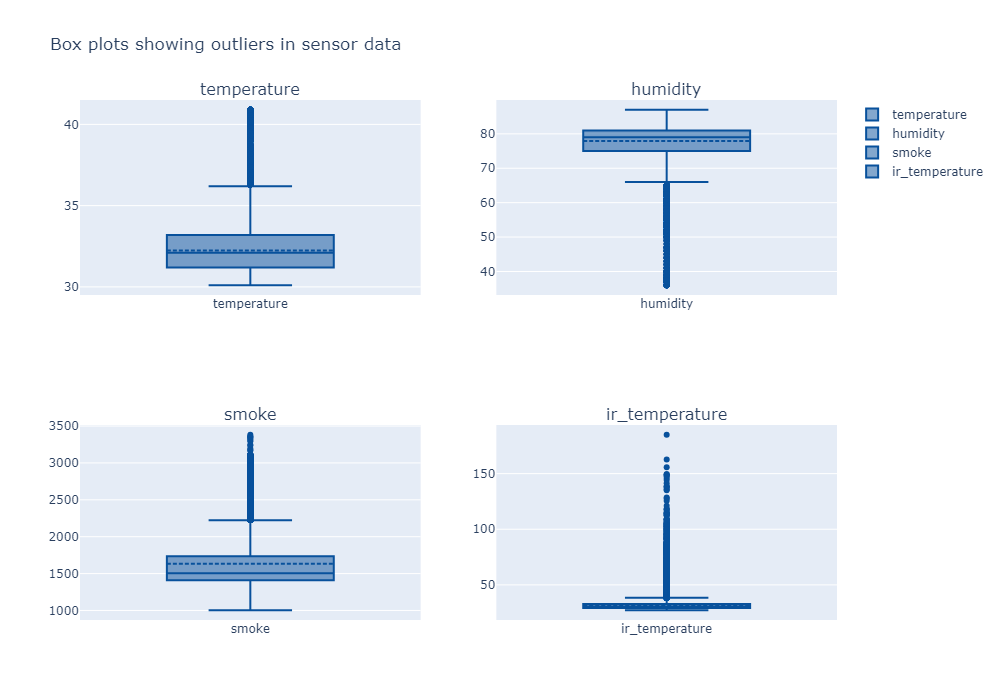

# FireShield360: Wildfire Detection and Prediction System


_Empowering early wildfire detection with advanced sensor data analytics and machine learning._

---

## Table of Contents

- [FireShield360: Wildfire Detection and Prediction System](#fireshield360-wildfire-detection-and-prediction-system)
  - [Table of Contents](#table-of-contents)
  - [Project Overview](#project-overview)
  - [Features](#features)
  - [Installation](#installation)
    - [Prerequisites](#prerequisites)
    - [Steps](#steps)
  - [Usage](#usage)
    - [Running the Jupyter Notebook](#running-the-jupyter-notebook)
    - [Making Predictions with New Data](#making-predictions-with-new-data)
    - [Example Output](#example-output)
  - [Data Processing Pipeline](#data-processing-pipeline)
  - [Model Architecture](#model-architecture)
  - [Visualizations](#visualizations)
  - [Contributing](#contributing)
  - [License](#license)
    - [Image Placeholder Instructions](#image-placeholder-instructions)

---

## Project Overview

FireShield360 is an advanced wildfire detection and prediction system designed to analyze environmental sensor data for early identification of wildfire risks. By leveraging time-series data from IoT sensors (temperature, humidity, smoke, and infrared temperature), the system employs feature engineering, outlier detection, and Long Short-Term Memory (LSTM) neural networks to forecast environmental conditions and assess wildfire potential.

This project is built using Python, Pandas, TensorFlow, and Plotly, with a focus on robust data preprocessing, feature engineering, and model optimization for real-time applications.

---

## Features

- **Data Preprocessing**: Cleans and filters sensor data, handling missing values and outliers using Z-score and IQR methods.
- **Feature Engineering**: Generates time-based, rolling window, lag, and domain-specific features (e.g., Fire Danger Index, Heat-Dryness Index).
- **Outlier Detection**: Identifies and handles anomalies in sensor readings to ensure data reliability.
- **LSTM Models**: Trains deep learning models for each sensor variable to predict future environmental conditions.
- **Visualization**: Provides interactive time-series plots, correlation heatmaps, and prediction visualizations using Plotly and Seaborn.
- **Prediction Pipeline**: Enables forecasting of 24 future timesteps based on 60 historical timesteps, with results saved to CSV.
- **Scalability**: Designed for integration with real-time data streams and IoT sensor networks.

---

## Installation

### Prerequisites

- Python 3.8+
- pip or conda for package management
- Optional: GPU support for TensorFlow (CUDA-enabled GPU recommended for faster training)

### Steps

1. **Clone the Repository**:

   ```bash
   git clone https://github.com/your-username/fireShield360.git
   cd fireShield360
   ```

2. **Create a Virtual Environment** (recommended):

   ```bash
   python -m venv venv
   source venv/bin/activate  # On Windows: venv\Scripts\activate
   ```

3. **Install Dependencies**:

   ```bash
   pip install -r requirements.txt
   ```

   Alternatively, install the required packages manually:

   ```bash
   pip install matplotlib pandas numpy seaborn plotly tensorflow
   ```

4. **Download Sample Data**:

   - Place the sensor data CSV file (e.g., `sensor_readings_export_20250501_184851.csv`) in the `raw/` directory.
   - Example data structure:
     ```
     timestamp,device_id,temperature,humidity,smoke,ir_temperature,...
     2025-05-01T00:00:00Z,esp32_01,25.5,60.2,1200,22.3,...
     ```

5. **Set Up Model Directory**:
   - Ensure the `models/` directory exists for saving trained models and metadata:
     ```bash
     mkdir models
     ```

---

## Usage

### Running the Jupyter Notebook

1. Launch Jupyter Notebook:

   ```bash
   jupyter notebook fireShield360.ipynb
   ```

2. Execute the cells in sequence to:
   - Load and preprocess sensor data
   - Perform feature engineering and outlier detection
   - Train LSTM models
   - Generate predictions and visualizations
   - Save results to CSV

### Making Predictions with New Data

Use the `make_future_predictions` function to forecast future sensor readings:

```python
import pandas as pd
from prediction import make_future_predictions

# Load your data (at least 60 timesteps)
data = pd.read_csv('raw/your_sensor_data.csv')

# Generate 24-step predictions
predictions = make_future_predictions(data.iloc[-60:], steps=24, save_results=True)
print(predictions)
```

This will generate a CSV file containing historical and predicted values, along with interactive visualizations.

### Example Output

- **CSV Output**: `combined_data_YYYYMMDD_HHMMSS.csv`

  ```
  timestamp,temperature,humidity,smoke,ir_temperature,fire_danger_index,data_type
  2025-05-01T00:00:00Z,25.5,60.2,1200,22.3,18.45,historical
  ...
  2025-05-01T00:24:00Z,26.1,59.8,1250,22.8,18.72,predicted
  ```

- **Visualization**: Interactive Plotly plots showing historical and predicted values for each sensor.


---

## Data Processing Pipeline

The data processing pipeline is designed to ensure high-quality input for model training and prediction. Below is a summary of the steps, as implemented in the notebook:

1. **Data Loading**:

   - Loads CSV data from IoT sensors (`sensor_readings_export_20250501_184851.csv`).
   - Filters for a single device (`esp32_01`) to focus analysis.

2. **Cleaning**:

   - Removes irrelevant columns (e.g., `smoke_detected`, `wildfire_detected`).
   - Converts timestamps to datetime and ensures numerical columns are float.
   - Drops rows with missing `ir_temperature` values and fills other missing values with column means.

3. **Outlier Detection**:

   - Uses Z-score and IQR methods to identify anomalies.
   - Caps outliers at IQR bounds to preserve time-series structure.

4. **Threshold Filtering**:

   - Removes data points below thresholds (e.g., temperature < 30°C, smoke < 1000) to focus on wildfire-relevant conditions.

5. **Feature Engineering**:

   - **Time-based**: Hour, day, cyclical encodings (sin/cos) for temporal patterns.
   - **Rolling Window**: Mean, std, max, min over 10, 30, 60-minute windows.
   - **Lag Features**: Lagged values and differences for historical context.
   - **Domain-specific**: Heat-Dryness Index, Fire Danger Index, etc.

6. **Data Validation**:
   - Checks correlations between sensors (e.g., temperature and smoke) for physical consistency.
   - Ensures data shape and integrity after each processing step.

[![](https://mermaid.ink/img/pako:eNptlt1u2kgUx19lZGnbGxz5C5L4otoEQ6CBbhdQV-qyiib2AUa1Z7z2OAmN8k77DPtke84MYNPuRaTY_p3_-Z7h1UlVBk7suK67lqmSG7GN15KxnO9Vo2O2ES-QmRdKfYvZjsssqfizpFd6BwXELIMNb3K9lkZjk6vndMcrzVYJQYzd_Ll2ZopnbMGf2RJkrSqWcM3Xzl_MdT-w219f0d0j5DFbO2ORa8Dv8CRSYNOEvYe6DIMHz3-_dtibVbw1dkPUJR02zIFLIbcoaL8P7XefgEqV7JOSLtQ1SC14zoYqbwpZt7Rv8QDxBRTqCdhc1DUKsi88b6BDBpYMkRwq-QSUpSig1rwoO1hosQixCRYsB_apKaASKXo3Ea_2ZVc2MnyC-GpXQb1TecZsIbpZJZairA5VWkFRQsV1UwH7wELv33-GLW2zSoIWnzSFyITeI-t7v7SkzSoJW3JZqG9gMM9rOZtWErXcdGFiQDI4d24zGlGdqDmQmbxr0CzbRCdsZKgxUr81Ohem7xpSLZQ8MWPLUNZf3TpVmOoc9E5lND7v2Jjym_6-aF8ezGz6dx1t04puQcc28Tv7dGcfyNGQlyW1n2tG0reqkVnbrjsrPaEygC3-SG6FhPN2TSxFejQj7iOmj221FrWNfmJmTuUUFvtDyEw9_0hQV2Z8--NrakKiCi6kW5eQio1Iu8ghhEOkPkd69KIrnmo2UU3Vw3bse2yupN51aH7AH6kG-zQ3AzvCYyE7S8yWbRLwTvBz7HKPLXWGqgL_m_OXjsFBOCDhBdfA1IYN8SzZAuZyk6aQ0xh32z6xwzYJuc1_i7Wz20hd8b0ejnuPDfDPD7xCdA0PzkJylojNBiqQKdq9Y5-hSvEQ4OjWeu-Uyk7sJCJ_Eyykm1R7iYcGm8oMXo5VJ83O1rm4AEcXdLYcsRQxs0Nud0UXlOIRycwW4duEAqlObo69eDTxTDtDNi1KVWmOubAbyfN9LTrhBwf-WITzxyjrPk7tg2-agTNXsDGuVa1_lp3aAfrYiWKJvTrf0I-WITn78RSpPo0kK-m44tUWdGtnxe_Rbo6XUM5uG5GfTdq9BUj5cwUlN-7_bkw7W-ggQ6u0xIGFn_fg3k7sPe3SqsKdYbPlas6M1w5lR-6eVmv0hLNGg4ojs1FVQVVvQTsrM6pKY4pC9Ut5rbvBzyxEwd-BpBkAFkRuraFkmE0mTBVb9zObx8zkwZ9oM76IuuG5-I6jAzVesR3YZjS3lTlosXEjz1sztxTFUPBv8LAx4T6Urfv_sbFxzO11yHNX4-nViZjh6cgfRY4XycmGrvB6x0v8NYCF0G9Oz9lWInPiDc9r6Dl4-eFRhc_OKxmsHfPTYe3QjX_8-eCsJdmVXH5VqnBiXTVoWalmuzvpNGWGZUwE31a8RQBXpxriIa2dGE8GknDiV-fFicNgcNG_9AbXgyj0wv71oN9z9k7s-pcXXnAVRaHvh4PA618Fbz3nu3HrX3jR5VU_ioKwHwTX0XXw9h8UocLT?type=png)](https://mermaid.live/edit#pako:eNptlt1u2kgUx19lZGnbGxz5C5L4otoEQ6CBbhdQV-qyiib2AUa1Z7z2OAmN8k77DPtke84MYNPuRaTY_p3_-Z7h1UlVBk7suK67lqmSG7GN15KxnO9Vo2O2ES-QmRdKfYvZjsssqfizpFd6BwXELIMNb3K9lkZjk6vndMcrzVYJQYzd_Ll2ZopnbMGf2RJkrSqWcM3Xzl_MdT-w219f0d0j5DFbO2ORa8Dv8CRSYNOEvYe6DIMHz3-_dtibVbw1dkPUJR02zIFLIbcoaL8P7XefgEqV7JOSLtQ1SC14zoYqbwpZt7Rv8QDxBRTqCdhc1DUKsi88b6BDBpYMkRwq-QSUpSig1rwoO1hosQixCRYsB_apKaASKXo3Ea_2ZVc2MnyC-GpXQb1TecZsIbpZJZairA5VWkFRQsV1UwH7wELv33-GLW2zSoIWnzSFyITeI-t7v7SkzSoJW3JZqG9gMM9rOZtWErXcdGFiQDI4d24zGlGdqDmQmbxr0CzbRCdsZKgxUr81Ohem7xpSLZQ8MWPLUNZf3TpVmOoc9E5lND7v2Jjym_6-aF8ezGz6dx1t04puQcc28Tv7dGcfyNGQlyW1n2tG0reqkVnbrjsrPaEygC3-SG6FhPN2TSxFejQj7iOmj221FrWNfmJmTuUUFvtDyEw9_0hQV2Z8--NrakKiCi6kW5eQio1Iu8ghhEOkPkd69KIrnmo2UU3Vw3bse2yupN51aH7AH6kG-zQ3AzvCYyE7S8yWbRLwTvBz7HKPLXWGqgL_m_OXjsFBOCDhBdfA1IYN8SzZAuZyk6aQ0xh32z6xwzYJuc1_i7Wz20hd8b0ejnuPDfDPD7xCdA0PzkJylojNBiqQKdq9Y5-hSvEQ4OjWeu-Uyk7sJCJ_Eyykm1R7iYcGm8oMXo5VJ83O1rm4AEcXdLYcsRQxs0Nud0UXlOIRycwW4duEAqlObo69eDTxTDtDNi1KVWmOubAbyfN9LTrhBwf-WITzxyjrPk7tg2-agTNXsDGuVa1_lp3aAfrYiWKJvTrf0I-WITn78RSpPo0kK-m44tUWdGtnxe_Rbo6XUM5uG5GfTdq9BUj5cwUlN-7_bkw7W-ggQ6u0xIGFn_fg3k7sPe3SqsKdYbPlas6M1w5lR-6eVmv0hLNGg4ojs1FVQVVvQTsrM6pKY4pC9Ut5rbvBzyxEwd-BpBkAFkRuraFkmE0mTBVb9zObx8zkwZ9oM76IuuG5-I6jAzVesR3YZjS3lTlosXEjz1sztxTFUPBv8LAx4T6Urfv_sbFxzO11yHNX4-nViZjh6cgfRY4XycmGrvB6x0v8NYCF0G9Oz9lWInPiDc9r6Dl4-eFRhc_OKxmsHfPTYe3QjX_8-eCsJdmVXH5VqnBiXTVoWalmuzvpNGWGZUwE31a8RQBXpxriIa2dGE8GknDiV-fFicNgcNG_9AbXgyj0wv71oN9z9k7s-pcXXnAVRaHvh4PA618Fbz3nu3HrX3jR5VU_ioKwHwTX0XXw9h8UocLT)
_Diagram illustrating the data processing workflow._

---

## Model Architecture

The system uses LSTM neural networks for time-series forecasting, trained on feature-engineered datasets. Key details:

- **Model Structure**:

  - Two LSTM layers (128 and 64 units) with ReLU activation.
  - Dropout (0.3) for regularization.
  - Dense hidden layer (32 units) and single-unit output for regression.
  - Compiled with Adam optimizer and Mean Squared Error (MSE) loss.

- **Training**:

  - Uses 80% of data for training, 20% for testing.
  - Implements early stopping (patience=15) and learning rate scheduling.
  - Batch size: 32, max epochs: 100.

- **Feature Selection**:

  - Selects top 20 features per sensor based on feature importance (Random Forest).
  - Includes domain-specific features like Fire Danger Index.

- **Performance Metrics**:
  - Evaluates models using MSE, RMSE, MAE, R², and MAPE.
  - Visualizes predictions vs. actual values and future forecasts.

---

## Visualizations

The project includes a variety of visualizations to aid analysis and interpretation:

1. **Time-Series Plots**:

   - Displays sensor readings (temperature, humidity, smoke, IR temperature) over time.
   - Uses Plotly for interactive exploration and Seaborn for static plots.

   
   _Interactive time-series plot of sensor readings._

2. **Correlation Heatmap**:

   - Shows relationships between sensors (e.g., positive correlation between temperature and smoke).
   - Uses Seaborn with annotated values for clarity.

   
   _Correlation matrix of sensor readings._

3. **Outlier Detection**:

   - Box plots and scatter plots highlight outliers in sensor data.
   - Visualizes normal vs. anomalous data points over time.

   
   _Box plot showing outliers in sensor data._

4. **Prediction Visualizations**:

   - Compares actual vs. predicted values for each sensor.
   - Forecasts 24 future timesteps with a clear distinction between historical and predicted data.

   

To generate these visualizations, run the notebook cells under the "Temporal Pattern Analysis," "Correlation Analysis," and "Model Building" sections.

---

## Contributing

We welcome contributions to FireShield360! To contribute:

1. **Fork the Repository**:

   ```bash
   git clone https://github.com/your-username/fireShield360.git
   ```

2. **Create a Feature Branch**:

   ```bash
   git checkout -b feature/your-feature-name
   ```

3. **Commit Changes**:

   ```bash
   git commit -m "Add your feature description"
   ```

4. **Push and Create a Pull Request**:

   ```bash
   git push origin feature/your-feature-name
   ```

   - Submit a pull request with a clear description of your changes.

5. **Follow Coding Guidelines**:
   - Use PEP 8 for Python code.
   - Document functions and include comments for clarity.
   - Test changes with sample data before submitting.

Issues and feature requests can be submitted via the GitHub Issues page.

---

## License

This project is licensed under the MIT License. See the [LICENSE](LICENSE) file for details.

---

### Image Placeholder Instructions

To add images to the `README.md`, place the following files in the `images/` directory:

- `cover_image.jpg`: A high-resolution image of wildfire monitoring or IoT sensors.
- `wildfire_sensor_network.png`: Diagram of sensor deployment in a forest.
- `data_pipeline.png`: Flowchart of the data processing steps.
- `lstm_architecture.png`: Diagram of the LSTM model structure.
- `time_series_plot.png`: Screenshot of a Plotly time-series plot.
- `correlation_heatmap.png`: Screenshot of the correlation heatmap.
- `outlier_plot.png`: Screenshot of an outlier detection visualization.
- `prediction_plot.png`: Screenshot of a prediction plot.
- `prediction_vs_actual.png`: Screenshot of the predicted vs. actual scatter plot.

If these images are not available, you can generate them by:

- Running the visualization cells in the notebook and saving the outputs (e.g., `fig.write_image('images/time_series_plot.png')` for Plotly figures).
- Creating diagrams using tools like Draw.io or Lucidchart for pipeline and architecture visuals.
- Using stock images or AI-generated images for the cover and sensor network.

Ensure the `images/` directory is created:

```bash
mkdir images
```

---

_FireShield360: Protecting our forests through data-driven innovation._
